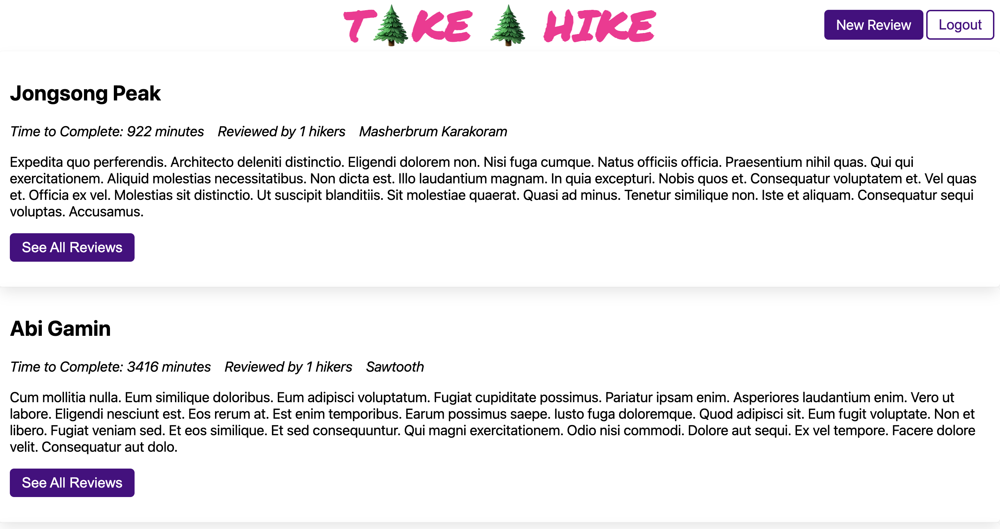

# Take A Hike

Take A Hike is an app to review hikes.

This app uses a Rails API and React frontend that can be deployed to a single
domain.

## Development Configuration

Configuration for running in development is in the `Procfile.dev` file. Run this
command to start the frontend and backend servers:

```sh
heroku local -f Procfile.dev
```

## User Stories

A user can...
  * sign up for the site
  * log in to the site
  * view a list of hikes
  * create a review for a specific hike
  * modify or delete a review



## This project was built for Flatiron School's Phase 4 Project

Last modified June 4 2022